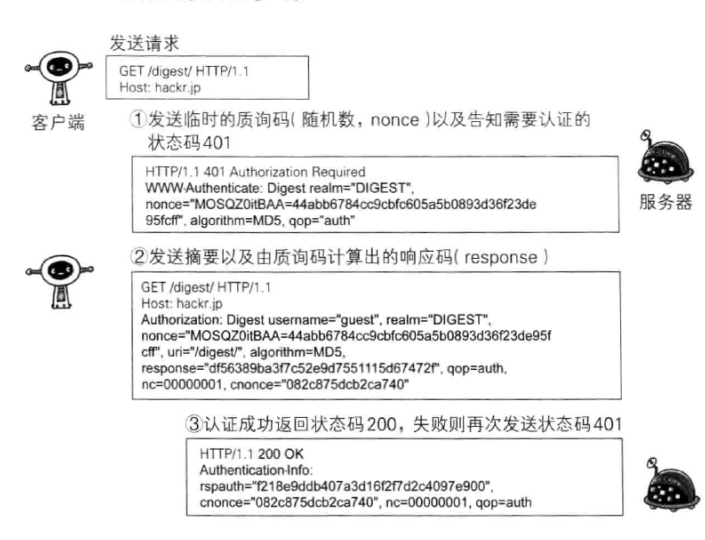

# 图解HTTP笔记
## 0x00 说明
[HTTP 1.1/RFC2616](http://www.ietf.org/rfc/rfc2616.txt)，HTTP无状态协议，不保留通信上下文，通过URI定位资源，结合cookie和session可以实现在客户端和服务端保留上下文信息。

### TCP的三次握手&四次挥手

### TCP报文信息


### OSI七层网络模型 & TCP/IP四层模型


## 0x02 简单的HTTP协议
HTTP1.0中每次请求都重新进行TCP连接，1.1中加入了keep-alive持久连接，同时支持了并发多个请求。
```bash
#GET请求方法，有长度限制
GET /index.php HTTP/1.1
Host:www.exp.com

#POST请求，进行数据传输
POST /index.php HTTP/1.1
Host:www.exp.com
Content-Length: 1560

#PUT 传输文件，一般不使用
PUT /index.php HTTP/1.1
Host: www.exp.com
Content-Type: text/html
Content-Length: 1560

#HEAD 获取报文首部，不返回报文主体，用于确认URI资源的有效性等
HEAD /index.php HTTP/1.1
Host: www.exp.com

#OPTIONS 询问支持的方法
#TRACE 追踪路径
#CONNECT 要求使用隧道协议连接代理
#DELETE 删除资源 不常用
```
## 0x03 HTTP首部
以一个HTTP报文和返回信息来说明，更多信息[HTTP首部](https://ttop5.gitbooks.io/illustration-http/content/chapter6.html) [HTTP首部字段详解](http://www.cnblogs.com/jycboy/p/http_head.html)
#### 请求报文信息
```bash
POST /index.php HTTP/1.1 #请求行 (请求方法 路径 协议)
Host: www.exp.com #主机域名

Cache-Control:private, max-age=0, no-cache #控制缓存行为
Connection:keep-alive #管理持久连接[keep-alive |close]  控制不再转发给代理的首部字段:Upgrade
Date: Sun, 11-Jun-17 13:14:07 GMT #创建报文的时间
Via: 1.0 ak.cn (Sequid/3.1)#代理服务器的相关信息
Transfer-Encoding:chunked #传输报文主体时采用的编码格式，chunked分块传输
Upgrade: TLS/1.0, HTTP/1.1 #检查http协议是否有更高版本通信

Content-Type: multipart/form-data #请求格式 
Range: buytes=1-1000 #请求范围
Accept: text/html,application/xml; #支持数据类型
Accept-Charset:iso-8859-5 #优先字符集
Accept-Encoding:gzip, deflate, identity#支持压缩格式 gzip,不压缩
Accept-Language: zh-CN,zh;q=0.8,de;q=0.6 #客户端支持语言&权重
Content-Language:
Referer: http://www.baidu.com # 请求来源
User-Agent:Mozilla/5.0 #代理
Authorization: #web认证信息
DNT:1 #禁止跟踪
Max-Forwards: 5 #最大传输逐跳数
Cookie:BAIDUID=93F88E51E0D12666C900B1CDEAE88E29:FG=1;
\r\n #CR+LF换行 下面为报文主体
```
#### 接收报文信息
```bash
Accept-Ranges: bytes#是否接受字节范围请求 btyes 和none
Age: 60#推算资源创建经过时间，秒
Etag: "123" #资源的匹配信息
Location: https://dolinpa.com #资源重定向到指定的URI
Proxy-Authenticate: #代理服务器对客户端的认证信息
Vary: #代理服务器缓存的管理信息
Retry-After: 120 #多久后重新请求
Server:nginx 1.2 #服务器信息
Allow: GET,HEAD #允许接收的方法
Expires: Sun, 11-Jun-17 13:14:07 GMT #资源失效日期
Set-Cookie:key=value; expires=Sun, 11-Jun-17 13:14:07 GMT; domain=www.baidu.com; path=/ #cookie信息 key:value 过期时间 作用域
```

## 0x04 HTTP状态码

- **1xx 信息性状态码   接受的请求正在处理中**
- **2xx 成功状态码   请求正常处理完毕**
- - 200 请求正常
- - 204 no content 请求处理成功，但没有资源可返回
- - 206 partial content 对一部分资源的请求，响应请求头中Content-Range的范围
- **3xx 重定向状态码 需要进行附加操作已完成请求**
- - 301 moved permanently 永久重定向
- - 302 found 临时重定向
- - 304 not modified 资源已找到，单位符合条件请求
- **4xx 客户端错误状态码 服务器无法处理请求**
- - 400 bad request 请求报文中有语法错误
- - 401 unauthorized 需要认证的请求
- - 403 forbidden 服务端拒绝请求
- - 404  not found
- **5xx 服务器错误状态码  服务器处理请求出错**
- - 500 internal server error 服务器执行请求时发生错误
- - 503 service unavaiable 超负载无法响应请求
## 0x05 HTTPS
HTTP是直接和TCP通信，HTTPS先和SSL通信，再由SSL和TCP通信。SSL独立于HTTP之外，采用公开密钥加密的方式或者说非对称加密，其公钥由数字证书认证机构CA保留认证，私钥由服务器保留。[SSL/TSL运行机制的概述](http://www.ruanyifeng.com/blog/2014/02/ssl_tls.html)

### HTTPS通信流程


1. 客户端发送client hello报文开始ssl通信，包含了客户端支持的ssl的版本、加密组件列表等
2. 服务器可进行ssl通信时，会议server hello报文作为应答。和客户端一样，在报文中包含了ssl版本，加密组件(服务端的这些信息是从客户端中筛选出来的)
3. 服务器发送certificate报文，报文中包含公开密钥证书
4. 服务端发送server hello done报文通知客户端，最初阶段的ssl报文协商部分结束
5. ssl第一次报文结束后，客户端以client key exchange报文作为回应。报文中包含通信加密中使用的一种被称为pre-master secret的随机密码串。该报文用步骤3中的公开密钥加密
6. 客户端发送change cipher spec报文，该报文会提示服务器，在此报文之后的通信会采用pre-master secret密钥加密
7. 客户端发送finished报文，该报文包含连接至今全部报文的整体校验值，这次握手协商是否能够成功，要以服务器是否能够正确解密该报文作为判断标准
8. 服务器发送change ciper spec报文
9. 服务器发送finished报文
10. 服务器和客户端的finished报文交换完毕之后，ssl连接计算建立完成。通信会受到ssl保护，之后发送http请求
11. 通信结束后由客户端发起close_notify报文，在发送TCP FIN报文关闭TCP连接


## 0x06 HTTP认证信息
HTTP/1.1使用BASIC认证，DIGEST摘要认证，SSL客户端认证和FormBase表单认证
### BASIC认证


### DIGEST认证


## 0x07 HTTP 2.0
